# Hi my name is Aleksandr Gladushenko #
### I am a fullstack developer ###

## Languages and Tools

  
  

  

  
 
  

  

## Contact with me ##

  
 

    
My certificates

     
    <table width="100%">
        <tr align="center">
            <td colspan="3" width="100%">
                <a href="https://www.sololearn.com/">Sololearn</a>
            </td>
        </tr>
        <tr>
            <td width="50%">
                
            </td>
            <td width="50%">
                
            </td>
        </tr>
    </table>
    <table width="100%">
        <tr align="center">
            <td colspan="3" width="100%">
                <a href="https://javascript.info" target="_blank">JavaScript.info</a>
            </td>
        </tr>
        <tr>
            <td width="50%">
                
            </td>
            <td width="50%">
            </td>
        </tr>
    </table>
    <table width="100%">
        <tr align="center">
            <td colspan="3" width="100%">
                <a href="https://gb.ru/" target="_blank">GeekBrains</a>
            </td>
        </tr>
        <tr>
            <td width="50%">
                
            </td>
            <td width="50%">
                
            </td>
        </tr>
        <tr>
            <td width="50%">
                <a href="https://gb.ru/certificates/1581272.en" target="_blank">
                    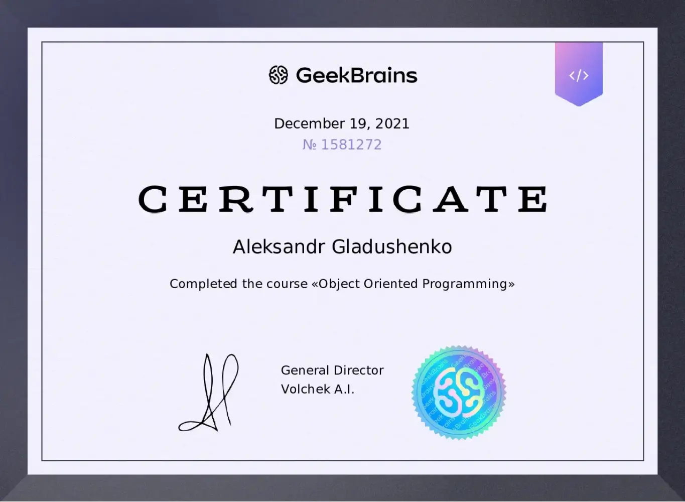
                </a>
            </td>
            <td width="50%"></td>
        </tr>
    </table>
    <table width="100%">
        <tr align="center">
            <td colspan="3" width="100%">
                <a href="https://netology.ru/" target="_blank">Netology</a>
            </td>
        </tr>
        <tr>
            <td width="50%">
                <a href="https://netology.ru/backend/api/user/programs/23465/pdf_certificate" target="_blank">
                  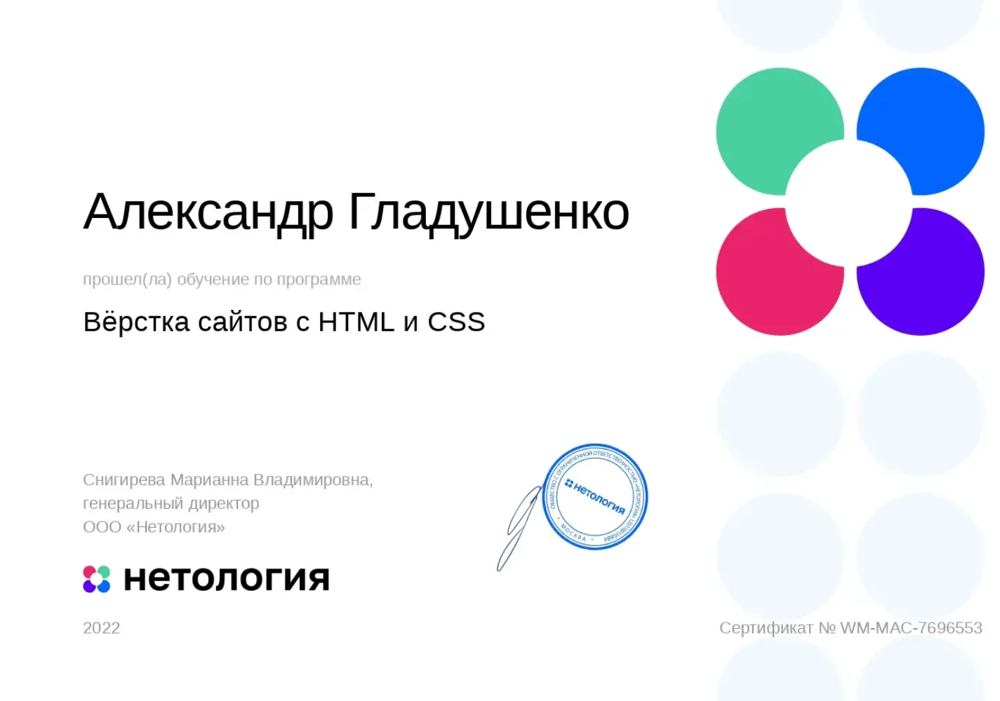
                </a>
            </td>
            <td width="50%"></td>
        </tr>
    </table>
    <table width="100%">
        <tr align="center">
            <td colspan="3" width="100%">
                <a href="https://www.1c-bitrix.ru/" target="_blank">1C-Bitrix</a>
            </td>
        </tr>
        <tr>
            <td width="33%">
                <a href="https://www.1c-bitrix.ru/partners/check_cert.php?cert=CERT-EX-DEV-010-14034510-5214414-661093" target="_blank">
                  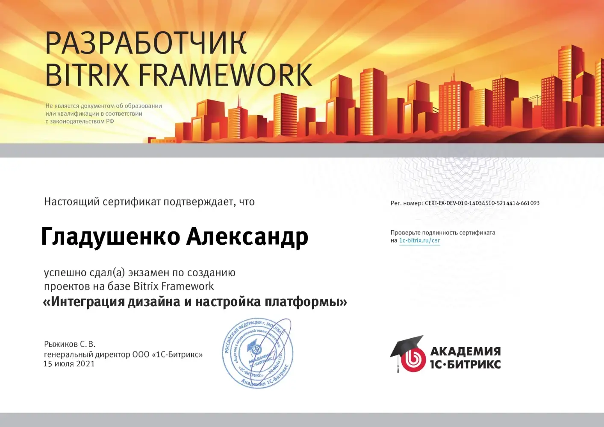
                </a>
            </td>
            <td width="33%">
                <a href="https://www.1c-bitrix.ru/partners/check_cert.php?cert=CERT-EX-DEV-020-14661476-5214414-327029" target="_blank">
                  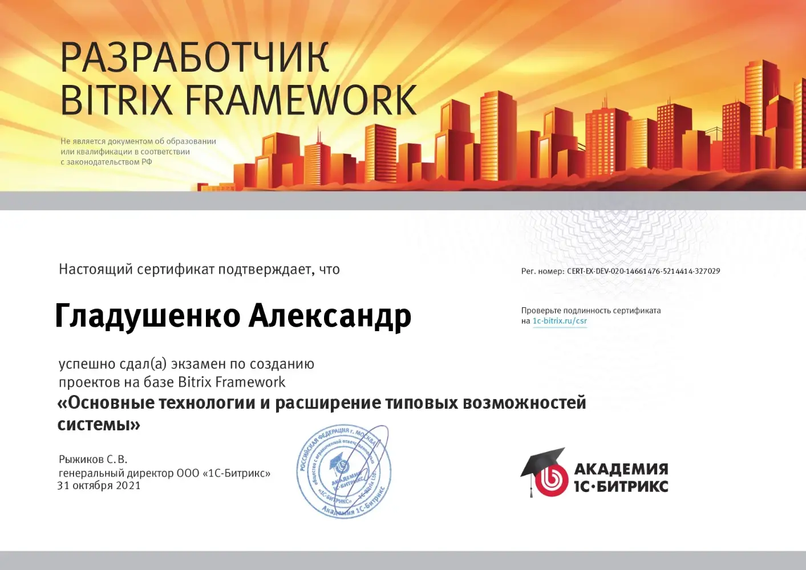
                </a>
            </td>
            <td width="33%">
                <a href="https://www.1c-bitrix.ru/partners/check_cert.php?cert=LRN-365626-42-415-5214414" target="_blank">
                  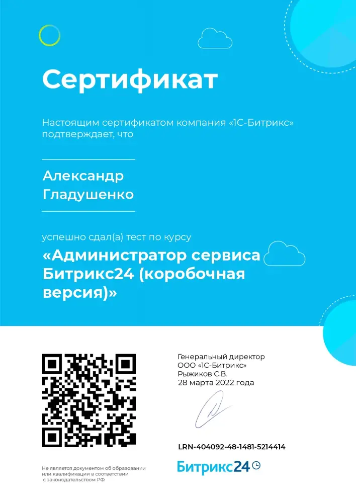
                </a>
            </td>
        </tr>
        <tr>
            <td width="33%">
                
            </td>
            <td width="33%">
                <a href="https://www.1c-bitrix.ru/partners/check_cert.php?cert=LRN-365626-42-415-5214414" target="_blank">
                  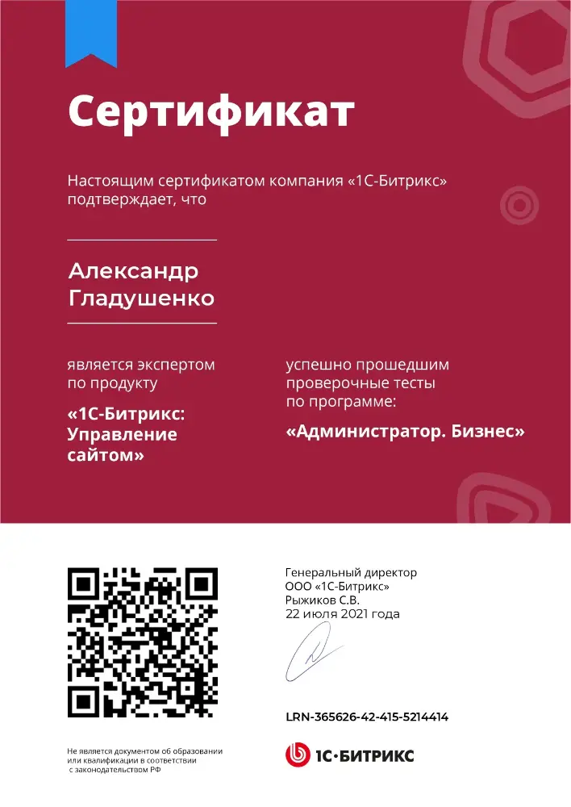
                </a>
            </td>
            <td width="33%">
                <a href="https://www.1c-bitrix.ru/partners/check_cert.php?cert=LRN-365548-41-423-5214414" target="_blank">
                  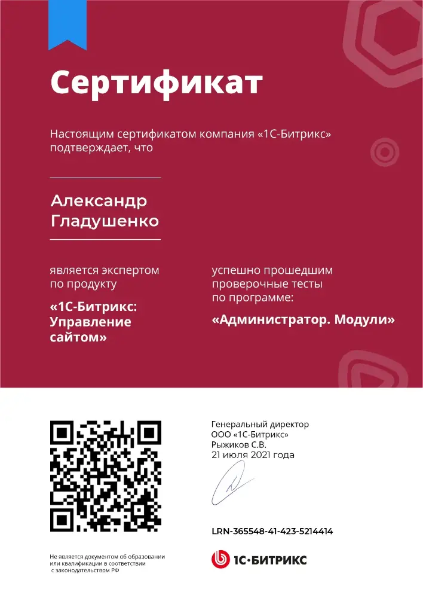
                </a>
            </td>
        </tr>
        <tr>
            <td width="33%">
                <a href="https://www.1c-bitrix.ru/partners/check_cert.php?cert=LRN-369054-39-124-5214414" target="_blank">
                  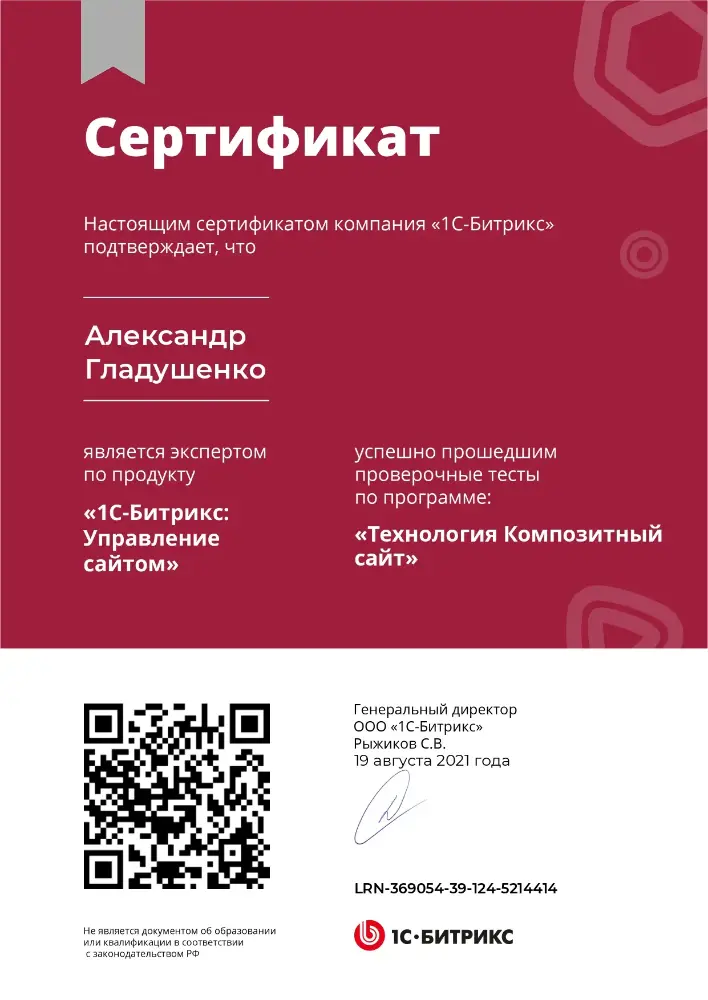
                </a>
            </td>
            <td width="33%">
                <a href="https://www.1c-bitrix.ru/partners/check_cert.php?cert=LRN-420592-103-223-5214414" target="_blank">
                  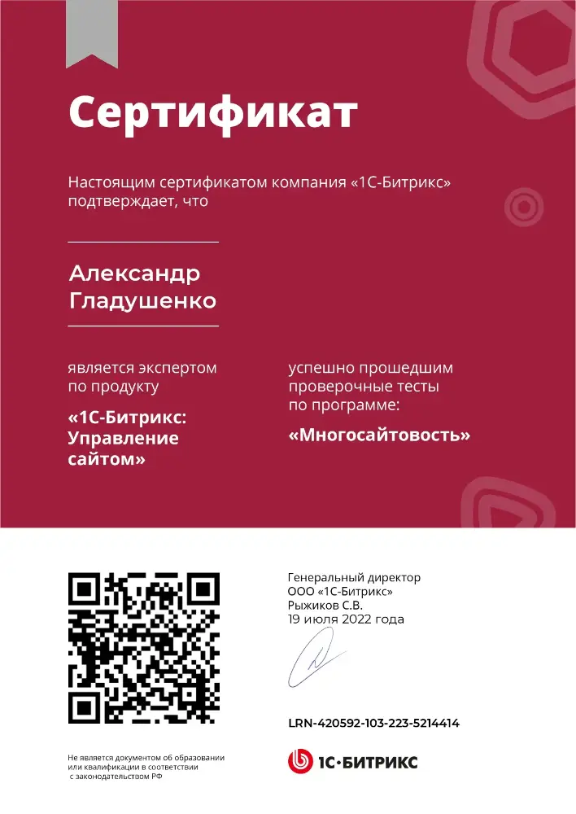
                </a>
            </td>
            <td width="33%">
                <a href="https://www.1c-bitrix.ru/partners/check_cert.php?cert=LRN-374598-131-128-5214414" target="_blank">
                  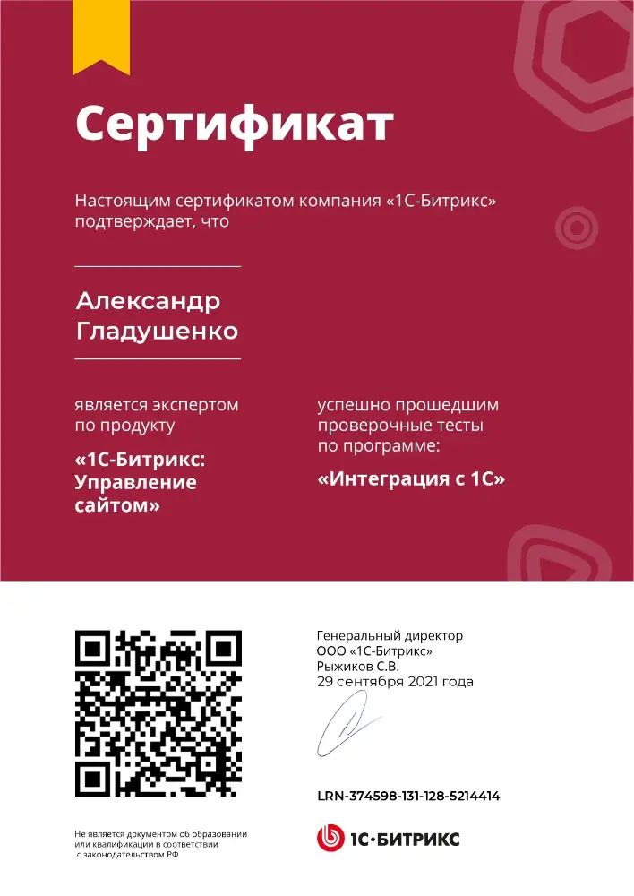
                </a>
            </td>
        </tr>
        <tr>
            <td width="33%">
                <a href="https://www.1c-bitrix.ru/partners/check_cert.php?cert=LRN-452410-176-161-5214414" target="_blank">
                  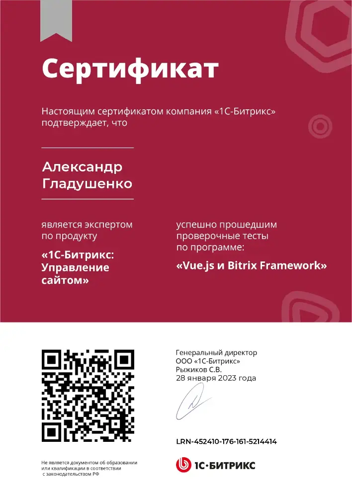
                </a>
            </td>
            <td width="33%">
                
            </td>
            <td width="33%"></td>
        </tr>
    </table>

[//]: # (
)

[//]: # (<a style="width: 50%;" href="https://github.com/braydoncoyer/tailwindcss-v2-dark-mode-template">)

[//]: # (  )

[//]: # (</a>)

[//]: # (<a style="width: 50%;" href="https://github.com/braydoncoyer/officeapi">)

[//]: # (  )

[//]: # (</a>)

[//]: # (
)
